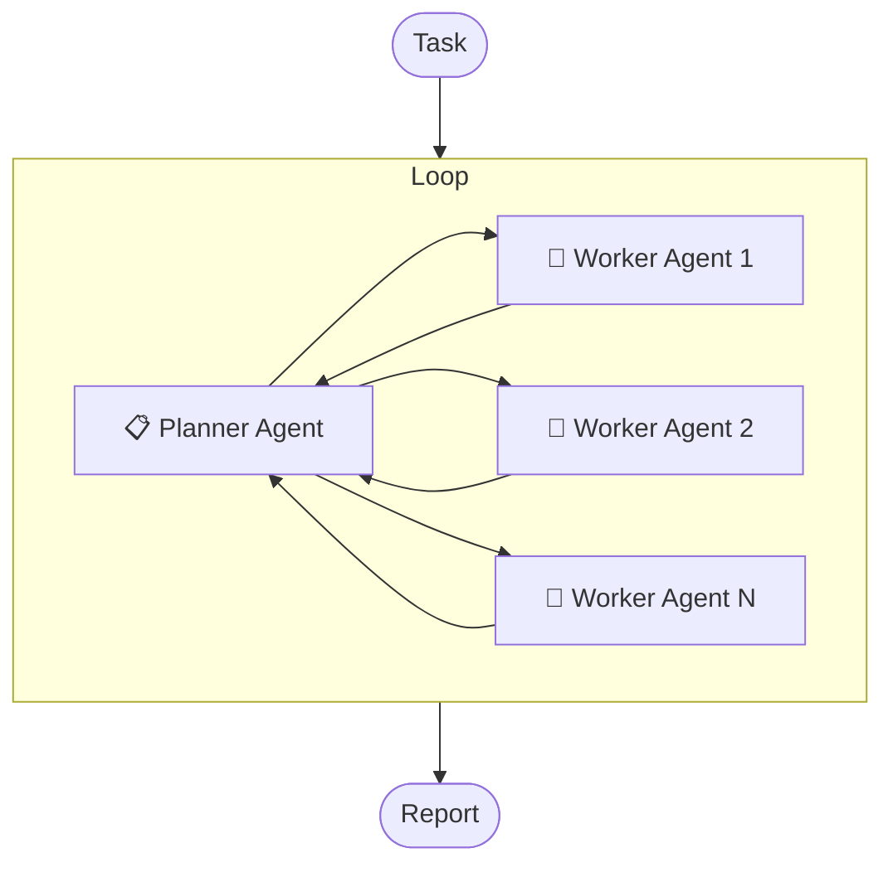

# DeepResearch

<div align="center">

[](LICENSE)
[](https://python.org)


中文 | [English](README.md)

</div>

一个基于多智能体架构的简单、直接且高度可扩展的深度研究工具，支持集成任意大型语言模型（LLM）和 MCP 工具。

## ✨ 特性

- 🔌 **兼容 OpenAI API**：支持任意符合 OpenAI API 的 LLM，无需工具调用能力。
- 🛠️ **通用 MCP 扩展**：支持集成任意 MCP 工具（stdio、streamable 或 sse），扩展 Agent 能力。
- 🌐 **简单直观**：同时暴露 HTTP 和 MCP 接口，接口简洁，对接方便。
- ⚡ **高性能异步**：基于 FastAPI，支持高并发请求处理。

## 工作原理



整体工作流程大致如下：

1. 用户提交研究任务到系统。
2. Planner 分析任务，拆分初始阶段的子任务，并将子任务分配给多个 Worker（可配置最多 max_subtasks 个子任务）。
3. 多个 Worker 并行执行子任务，并最终产出一份子任务报告。
4. 将所有子任务的报告聚合起来，然后返回给 Planner。
5. Planner 再次分析上下文和子任务结果，决定下一步行动。
6. 重复这个过程，直到满足以下条件之一：

   - Planner 认为信息充足，则主动产出报告。
   - 循环次数达到 `max_reasoning_times` 配置，系统强制将已有信息传入 Reporter，并请求其产出报告。

7. 系统将最终报告交付给用户。

## 🚀 快速开始

### 系统要求

- Python 3.10+

### 1. 克隆项目

```bash
git clone https://github.com/troyhantech/deep-research.git
cd deep-research
```

### 2. 安装依赖

```bash
pip install uv
uv pip install -r requirements.txt

# 或

pip install -r requirements.txt
```

### 3. 配置

#### 3.1 环境变量配置

复制模版文件：

```bash
cp .env.example .env
```

编辑 `.env` 文件，配置你的密钥:

```env
OPENAI_API_KEY="your-openai-api-key"
OPENAI_BASE_URL="https://api.openai.com/v1/"

# 可选: LangSmith tracing
LANGSMITH_TRACING="true"
LANGSMITH_ENDPOINT="https://api.smith.langchain.com"
LANGSMITH_API_KEY="your-langsmith-api-key"
LANGSMITH_PROJECT="your-langsmith-project"
```

#### 3.2 应用配置文件

复制模版文件：

```bash
cp config.toml.example config.toml
```

编辑 `config.toml` 配置 agents 和 MCP 服务：

```toml
[agents]
[agents.planner]
model = "gpt-4o"
max_reasoning_times = 5
max_tokens = 4096
max_subtasks = 10

[agents.reporter]
model = "gpt-4o"
max_tokens = 4096

[agents.worker]
model = "gpt-4o"
max_tokens = 4096
max_reasoning_times = 5

# 支持三种标准 MCP 传输方式：streamable_http、stdio 或 sse。根据需要配置任意 MCP 服务，例如使用 tavily：
[mcp_servers]

# 使用 stdio 方式调用 tavily
[mcp_servers.tavily_stdio]
enabled = false
type = "stdio"
command = "npx"
args = ["-y", "mcp-remote", "https://mcp.tavily.com/mcp/?tavilyApiKey=your-tavily-api-key"]
include_tools = ["tavily_search"] # 仅使用 tavily_search 工具，如果不填，则默认可以使用该 MCP 服务的所有工具

# 使用 streamable_http 方式调用 tavily
[mcp_servers.tavily_streamable_http]
enabled = true
type = "streamable_http"
url = "https://mcp.tavily.com/mcp/?tavilyApiKey=your-tavily-api-key"
include_tools = ["tavily_search"]

# 或者使用 sse 方式调用（已废弃，推荐使用 streamable_http）
[mcp_servers.sse_server_example]
enabled = false
type = "sse"
url = "sse_server_url"
include_tools = ["tavily_search"]
```

### 4. 启动服务

启动服务的命令为 `python main.py`，默认启动模式为 `mcp_stdio`，可以通过指定 `mode` 修改启动的模式：

```bash
python main.py

options:
  --env-file path to .env file, default: ./.env
  --config-file path to config.toml, default: ./config.toml
  --mode Launch mode: mcp_stdio, mcp_streamable_http, or http_api, default: mcp_stdio
  --host default: 0.0.0.0
  --port default: 8000
```

#### 4.1 启动 MCP STDIO 服务

启动 MCP STDIO 模式的命令为：

```bash
python main.py --mode mcp_stdio
```

通过 MCP 客户端启动，需要使用绝对路径显式指定配置文件的位置，例如，可以在 Claude Desktop 中配置：

```json
{
  "mcpServers": {
    "deep-research": {
      "command": "/ABSOLUTE/PATH/TO/python", // python 的绝对路径，linux 或 mac 系统：使用 which python 查看，windows 系统：使用 where python 查看
      "args": [
        "/ABSOLUTE/PATH/TO/main.py", // 项目的 main.py 在你的机器上的绝对路径
        "--env-file",
        "/ABSOLUTE/PATH/TO/.env", // 项目的 .env 文件在你的机器上的绝对路径
        "--config-file",
        "/ABSOLUTE/PATH/TO/config.toml", // 项目的 config.toml 文件在你的机器上的绝对路径
        "--mode",
        "mcp_stdio"
      ]
    }
  }
}
```

#### 4.2 启动 MCP STREAMABLE HTTP 服务

启动 MCP STREAMABLE HTTP 模式的命令为：

```bash
python main.py --mode mcp_streamable_http --host 0.0.0.0 --port 8000
```

现在可以通过在 MCP 客户端中配置 `http://localhost:8000/mcp/` 远程访问您的 deep-research 服务。

#### 4.2 启动 HTTP API 服务

启动 HTTP API 模式的命令为：

```bash
python main.py --mode http_api --host 0.0.0.0 --port 8000
```

现在可以通过以下方式访问：

- API 接口：`http://localhost:8000/deep-research`
- Web 网页：`http://localhost:8000/web`

通过 HTTP POST 请求 `http://localhost:8000/deep-research`，发送你的调研任务，等待一段时间后，将响应一份调研报告。

**请求 Body:**

```json
{
  "task": "分析未来一个月比特币的价格趋势走向，中文输出"
}
```

**响应 Body:**

```json
{
  "result": "# 比特币（BTC）未来一个月价格趋势分析\n\n## 引言\n\n本报告旨在对未来一个月（2025 年 8 月 18 日至 2025 年 9 月 17 日）比特币（BTC）的价格趋势进行核心驱动因素分析。通过聚焦市场资金面、技术图表和关键宏观信号，我们力求抓住当前市场的主要矛盾，判断 BTC 在此期间的潜在方向和关键价位。……"
}
```

**快速开始示例:**

- 可以浏览器访问 `http://localhost:8000/web` 快捷试用。
- 可以通过以下命令请求 API：

```bash
curl -X POST "http://localhost:8000/deep-research" \
     -H "Content-Type: application/json" \
     -d '{"task": "分析未来一个月比特币的价格趋势走向，中文输出"}'
```

<details>
<summary><strong>通过接口配置模型参数</strong></summary>

默认情况下，会使用 `config.toml` 中的 agents 配置。

另外，支持在请求的时通过 config 字段指定各个 agent 的配置，同时支持可以是部分更新，即：可以仅传入某个 agent 的配置，其他 agent 使用 `config.toml` 中的配置。

格式如下所示：

```json
{
  "task": "分析未来一个月比特币的价格趋势走向，中文输出",
  // 可选，默认使用 config.toml 中的 agents 配置
  "config": {
    "planner": {
      "model": "gpt-4o",
      "max_reasoning_times": 5,
      "max_tokens": 4096,
      "max_subtasks": 10
    },
    "worker": {
      "model": "gpt-4o",
      "max_tokens": 4096,
      "max_reasoning_times": 5
    },
    "reporter": {
      "model": "gpt-4o",
      "max_tokens": 4096
    }
  }
}
```

</details>

> **调研任务技巧**
>
> 调研任务应该清晰具体，一个清晰的调研任务应该包含以下几个方面：
>
> 1. 调研的主题：调研任务的主题是什么？
> 2. 调研的背景：为什么要做着个调研？调研的目标是什么？
> 3. 调研的要求：对调研的要求有哪些？

## ❓ 常见问题 (FAQ)

### Q: 支持哪些 LLM 模型？

A: 支持任何兼容 OpenAI API 的模型，包括 OpenAI GPT 系列、OpenRouter 等。

### Q: 必须使用具有 Function Call 能力的模型吗？

A: 不需要，本项目不依赖模型的 Function Call 功能，只要是大语言模型即可。

### Q: 是否支持提示词缓存？

A: 不支持，目前 OpenAI、DeepSeek、Gemini 等服务商已经支持自动缓存机制，有足够多的模型支持使用。而各家手动缓存提示词的格式不尽相同，且相信“自动缓存提示词”是未来的趋势，所以暂不考虑支持提示词缓存。

### Q: 如何添加自定义 MCP 工具？

A: 在 `config.toml` 文件中的 `[mcp_servers]` 部分添加你的 MCP 服务配置即可。例如：对接自定义的知识库搜索 MCP 服务。

### Q: 如果不添加任何 MCP 工具，会有什么影响？

A: 不会有影响，只是系统无法使用 MCP 工具，只能使用模型自身的知识回答。

### Q: 只支持 Python 3.10+ 吗？

A: 不是，作者只测试 Python 3.10+ 版本，理论上应该 3.8+ 均可。

## License

本项目采用 MIT 许可证 - 查看 [LICENSE](LICENSE) 文件了解详情。

## 🤝 贡献指南

我们欢迎所有形式的贡献！无论是报告 bug、提出新功能建议，还是提交代码改进。

## 🐛 问题反馈

如果你发现了 bug 或有功能建议，请在 [Issues](https://github.com/troyhantech/deep-research/issues) 页面提交。

## ⭐ Star History

如果这个项目对你有帮助，请给我们一个 ⭐！

[](https://star-history.com/#troyhantech/deep-research&Date)

---

<div align="center">
  <p>Made with ❤️ by the troyhantech</p>
  <p>如果你喜欢这个项目，请考虑给一个 ⭐</p>
</div>
