# DeepResearch

<div align="center">

[](LICENSE)
[](https://python.org)


[中文](README.md) | English

</div>

A simple, direct, and highly scalable deep research tool based on multi-agent architecture, supporting arbitrary LLM and MCP tool integration.

## ✨ Features

- 🔌 **OpenAI API Compatible**: Supports any LLM compatible with OpenAI API, no function calling capability required.
- 🛠️ **Universal MCP Extension**: Supports integration of arbitrary MCP tools (stdio, streamable or sse) to extend Agent capabilities.
- 🌐 **Simple and Intuitive**: Exposes both HTTP and MCP interfaces with clean APIs for easy integration.
- ⚡ **High-Performance Async**: Built on FastAPI, supports high-concurrency request processing.

## How It Works

```mermaid
flowchart TD
    Task(["Task"]) --> AgentSystem

    subgraph AgentSystem["Loop"]
        Planner["📋 Planner Agent"]
        Worker1["🔧 Worker  Agent 1"]
        Worker2["🔧 Worker  Agent 2"]
        Worker3["🔧 Worker  Agent N"]

        Planner --> Worker1
        Planner --> Worker2
        Planner --> Worker3

        Worker1 --> Planner
        Worker2 --> Planner
        Worker3 --> Planner
    end

    AgentSystem --> Report(["Report"])
```



The general workflow is as follows:

1. The user submits a research task to the system.
2. The planner analyzes the task and dispatches initial-stage subtasks to workers(config no more than max_subtasks subtasks).
3. Workers execute the subtasks in parallel, and return the subtask reports.
4. Subtasks reports are aggregated and passed to the planner.
5. The planner analyzes the context and the subtask results to determine next action.
6. Repeat this process until one of the following conditions is met:

   - The Planner deems the information sufficient and proactively generates a report.
   - The number of iterations reaches the `max_reasoning_times` configuration, at which point the system forcibly passes the existing information to the Reporter and requests it to generate a report.

7. The system delivers the final report to the user.

## 🚀 Quick Start

### System Requirements

- Python 3.10+

### 1. Clone the Repository

```bash
git clone https://github.com/troyhantech/deep-research.git
cd deep-research
```

### 2. Install Dependencies

```bash
pip install uv
uv pip install -r requirements.txt

# or

pip install -r requirements.txt
```

### 3. Configuration

#### 3.1 Environment Variables

Copy the template file:

```bash
cp .env.example .env
```

Edit the `.env` file and configure your API keys:

```env
OPENAI_API_KEY="your-openai-api-key"
OPENAI_BASE_URL="https://api.openai.com/v1/"

# Optional: LangSmith tracing
LANGSMITH_TRACING="true"
LANGSMITH_ENDPOINT="https://api.smith.langchain.com"
LANGSMITH_API_KEY="your-langsmith-api-key"
LANGSMITH_PROJECT="your-langsmith-project"
```

#### 3.2 Application Configuration

Copy the template file:

```bash
cp config.toml.example config.toml
```

Edit `config.toml` to configure agents and MCP services:

```toml
[agents]
[agents.planner]
model = "gpt-4o"
max_reasoning_times = 5
max_tokens = 4096
max_subtasks = 10

[agents.reporter]
model = "gpt-4o"
max_tokens = 4096

[agents.worker]
model = "gpt-4o"
max_tokens = 4096
max_reasoning_times = 5

# Support three standard MCP transport as worker tools: streamable_http、stdio or sse.
[mcp_servers]

# use streamable_http tavily
[mcp_servers.tavily_streamable_http]
enabled = true
type = "streamable_http"
url = "https://mcp.tavily.com/mcp/?tavilyApiKey=your-tavily-api-key"

# or use stdio
[mcp_servers.tavily_stdio]
enabled = false
type = "stdio"
command = "npx"
args = ["-y", "mcp-remote", "https://mcp.tavily.com/mcp/?tavilyApiKey=your-tavily-api-key"]

# add any other sse server
[mcp_servers.sse_server_example]
enabled = false
type = "sse"
url = "sse_server_url"
```

### 4. Start the Service

The command to start the service is as follows, with the default launch mode being `mcp_stdio`. You can modify the launch mode by specifying the `mode` parameter:

```bash
python main.py

options:
  --env-file path to .env file, default: ./.env
  --config-file path to config.toml, default: ./config.toml
  --mode Launch mode: mcp_stdio, mcp_streamable_http, or http_api, default: mcp_stdio
  --host default: 0.0.0.0
  --port default: 8000
```

#### 4.1 Start MCP STDIO Service

The command to start the service in MCP STDIO mode is:

```bash
python main.py --mode mcp_stdio
```

To launch via MCP client, you need to explicitly specify the absolute paths to configuration files. For example, you can configure in Claude Desktop:

```json
{
  "mcpServers": {
    "deep-research": {
      "command": "python",
      "args": [
        "main.py",
        "--env-file",
        "/ABSOLUTE/PATH/TO/.env", // Replace with your .env file path
        "--config-file",
        "/ABSOLUTE/PATH/TO/config.toml", // Replace with your config.toml file path
        "--mode",
        "mcp_stdio"
      ]
    }
  }
}
```

#### 4.2 Start MCP STREAMABLE HTTP Service

```bash
python main.py --mode mcp_streamable_http --host 0.0.0.0 --port 8000
```

Now you can remotely access your deep-research service by configuring `http://localhost:8000/mcp/` in the MCP client.

#### 4.3 Start HTTP API Service

```bash
python main.py --mode http_api --host 0.0.0.0 --port 8000
```

Now you can access via:

- API endpoint: `http://localhost:8000/deep-research`
- Web interface: `http://localhost:8000/web`

Send your research task via HTTP POST request to `http://localhost:8000/deep-research`, and after some time, you'll receive a research report.

**Request Body:**

```json
{
  "task": "Analyze Bitcoin price trends for the next month, output in English"
}
```

**Response Body:**

```json
{
  "result": "# Bitcoin (BTC) Price Trend Analysis for Next Month\n\n## Introduction\n\nThis report aims to analyze the core driving factors of Bitcoin (BTC) price trends for the next month (August 18, 2025 to September 17, 2025). By focusing on market liquidity, technical charts, and key macroeconomic signals, we strive to identify the main market contradictions and determine BTC's potential direction and key price levels during this period..."
}
```

**Quick Start Examples:**

- You can quickly test via browser by visiting `http://localhost:8000/web`
- You can request the API using the following command:

```bash
curl -X POST "http://localhost:8000/deep-research" \
     -H "Content-Type: application/json" \
     -d '{"task": "Analyze Bitcoin price trends for the next month, output in English"}'
```

<details>
<summary><strong>Model Configuration via API</strong></summary>
By default, the service will use agent configurations from `config.toml`.

Additionally, you can specify configurations for each agent in the request's config field. Partial updates are supported, meaning you can provide configuration for just one agent while others will use the settings from `config.toml`.

Format example:

```json
{
  "task": "Analyze Bitcoin price trends for the next month, output in English",
  // Optional, defaults to agents config in config.toml
  "config": {
    "planner": {
      "model": "gpt-4o",
      "max_reasoning_times": 5,
      "max_tokens": 4096,
      "max_subtasks": 10
    },
    "worker": {
      "model": "gpt-4o",
      "max_tokens": 4096,
      "max_reasoning_times": 5
    },
    "reporter": {
      "model": "gpt-4o",
      "max_tokens": 4096
    }
  }
}
```

</details>

> **Research Task Tips**
>
> Research tasks should be clear and specific. A well-defined research task should include:
>
> 1. Research topic: What is the subject of the research?
> 2. Research background: Why is this research being conducted? What are the objectives?
> 3. Research requirements: What are the specific requirements for the research?

## ❓ Frequently Asked Questions (FAQ)

### Q: Which LLM models are supported?

A: Supports any model compatible with OpenAI API, including OpenAI GPT series, OpenRouter, etc.

### Q: Must I use models with Function Call capabilities?

A: No, this project does not depend on the model's Function Call functionality. Any large language model will work.

### Q: Is prompt caching supported?

A: No, prompt caching is not supported. However, most of the models support automatic caching mechanism, and there are enough models support it.

### Q: How to add custom MCP tools?

A: Add your MCP service configuration in the `[mcp_servers]` section of the `config.toml` file. For example: integrate custom knowledge base search MCP services.

### Q: If I don't add any MCP tools, will there be any impact?

A: No, there will be no impact. The system will still work, but agent won't be able to use MCP tools, and answer using their existing knowledge.

### Q: Only Python 3.10+ is supported?

A: No, the author only tests with Python 3.10+, but it should work with 3.8+ as well.

## License

This project is licensed under the MIT License - see the [LICENSE](LICENSE) file for details.

## 🤝 Contributing

We welcome all forms of contributions! Whether it's reporting bugs, suggesting new features, or submitting code improvements.

## 🐛 Issue Reporting

If you find bugs or have feature suggestions, please submit them on the [Issues](https://github.com/troyhantech/deep-research/issues) page.

## ⭐ Star History

If this project helps you, please give us a ⭐!

[](https://star-history.com/#troyhantech/deep-research&Date)

---

<div align="center">
  <p>Made with ❤️ by the troyhantech</p>
  <p>If you like this project, please consider giving it a ⭐</p>
</div>
