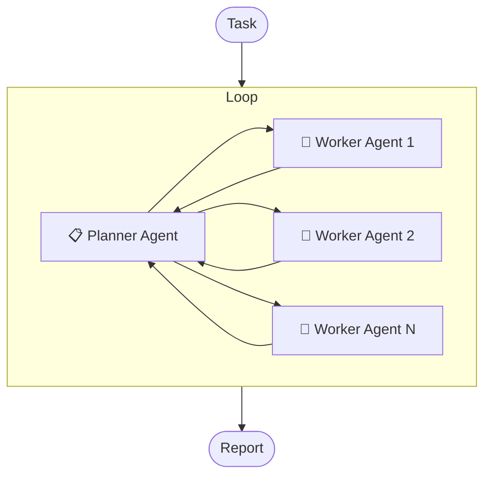

# DeepResearch

<div align="center">

[](LICENSE)
[](https://python.org)


中文 | [English](README.en.md)

</div>

一个基于多智能体架构的简单、直接且高度可扩展的深度研究工具，支持集成任意大型语言模型（LLM）和 MCP 工具。

## ✨ 特性

- 🔌 **兼容 OpenAI API**：支持任意符合 OpenAI API 的 LLM，无需工具调用能力。
- 🛠️ **通用 MCP 扩展**：支持集成任意 MCP 工具（stdio、streamable 或 sse），扩展 Agent 能力。
- 🌐 **简单直观**：同时暴露 HTTP 和 MCP 接口，接口简洁，对接方便。
- ⚡ **高性能异步**：基于 FastAPI，支持高并发请求处理。

## 工作原理



整体工作流程大致如下：

1. 用户提交研究任务到系统。
2. Planner 分析任务,拆分初始阶段的子任务，并将子任务分配给多个 Worker（最多 10 个子任务）。
3. 多个 Worker 并行执行子任务。
4. 所有子任务的结果被聚合并，然后返回给 Planner。
5. Planner 再次分析上下文和子任务结果，决定下一步行动。
6. 重复这个过程，直到信息满足调研任务。
7. 系统将最终报告交付给用户。

## 🚀 快速开始

### 系统要求

- Python 3.10+

### 1. 克隆项目

```bash
git clone https://github.com/your-username/deep-research.git
cd deep-research
```

### 2. 安装依赖

```bash
pip install uv
uv pip install -r requirements.txt

# 或

pip install -r requirements.txt
```

### 3. 配置

#### 3.1 环境变量配置

复制模版文件：

```bash
cp .env.example .env
```

编辑 `.env` 文件，配置你的密钥:

```env
OPENAI_API_KEY="your-openai-api-key"
OPENAI_BASE_URL="https://api.openai.com/v1/"

# 可选: LangSmith tracing
LANGSMITH_TRACING="true"
LANGSMITH_ENDPOINT="https://api.smith.langchain.com"
LANGSMITH_API_KEY="your-langsmith-api-key"
LANGSMITH_PROJECT="your-langsmith-project"
```

#### 3.2 应用配置文件

复制模版文件：

```bash
cp config.toml.example config.toml
```

编辑 `config.toml` 配置 agents 和 MCP 服务：

```toml
[agents]
[agents.planner]
model = "gpt-4o"
max_reasoning_times = 5
max_tokens = 4096

[agents.reporter]
model = "gpt-4o"
max_tokens = 4096

[agents.worker]
model = "gpt-4o"
max_tokens = 4096
max_reasoning_times = 5

# 支持三种标准 MCP 传输方式：streamable_http、stdio 或 sse。根据需要配置任意 MCP 服务。
[mcp_servers]

# 使用 streamable_http 方式调用 tavily
[mcp_servers.tavily_streamable_http]
enabled = true
type = "streamable_http"
url = "https://mcp.tavily.com/mcp/?tavilyApiKey=your-tavily-api-key"

# 或使用 stdio 方式调用 tavily
[mcp_servers.tavily_stdio]
enabled = false
type = "stdio"
command = "npx"
args = ["-y", "mcp-remote", "https://mcp.tavily.com/mcp/?tavilyApiKey=your-tavily-api-key"]

# 增加任意其他 sse 服务
[mcp_servers.sse_server_example]
enabled = false
type = "sse"
url = "sse_server_url"
```

### 4. 启动服务

```bash
python main.py
```

暴露方式：

- HTTP 服务：`http://localhost:8000`
- MCP 服务：`http://localhost:8000/mcp`

## 📖 使用指南

### HTTP 接口

通过 HTTP POST 请求该接口，发送你的调研任务，等待一段时间后，返回一份调研报告。

**POST** `/deep-research`

**请求 Body:**

```json
{
  "task": "Research the latest developments in quantum computing"
}
```

**响应 Body:**

```json
{
  "result": "# Quantum Computing Research Report\n\nQuantum computing has seen significant advancements...\n\n## References\n[1] [Source Title](https://example.com)\n[2] [Another Source](https://example2.com)"
}
```

**快速开始示例:**

```bash
curl -X POST "http://localhost:8000/deep-research" \
     -H "Content-Type: application/json" \
     -d '{"task": "分析未来一周比特币的价格趋势走向，中文输出"}'
```

> **使用技巧**
>
> 调研任务应该清晰具体，例如：
>
> ```txt
> 研究司美格鲁肽对全球医疗体系的经济影响。
> 需完成：
> - 包含具体数据、趋势、统计指标及可量化结果。
> - 优先采用可靠的最新信源：同行评议研究、卫生组织（如WHO、CDC）、监管机构或药企财报。
> - 需标注文中引用并附全部来源元数据。
>
> 要求保持分析性，避免笼统表述，确保每个结论都有数据支撑，能为医疗政策或财务模型提供依据。
> ```

### MCP 接口

服务同时暴露了 MCP 接口，可以将本服务作为 MCP 服务供任何 MCP 客户端使用。

在 MCP 客户端配置：

```json
{
  "mcpServers": {
    "deep-research": {
      "url": "http://localhost:8000/mcp"
    }
  }
}
```

## ❓ 常见问题 (FAQ)

### Q: 支持哪些 LLM 模型？

A: 支持任何兼容 OpenAI API 的模型，包括 OpenAI GPT 系列、OpenRouter 等。

### Q: 必须使用具有 Function Call 能力的模型吗？

A: 不需要，本项目不依赖模型的 Function Call 功能，只要是大语言模型即可。

### Q: 是否支持提示词缓存？

A: 不支持，目前 OpenAI、DeepSeek、Gemini 等服务商已经支持自动缓存机制，有足够多的模型支持使用。而各家手动缓存提示词的格式不尽相同，且相信“自动缓存提示词”是未来的趋势，所以暂不考虑支持提示词缓存。

### Q: 如何添加自定义 MCP 工具？

A: 在 `config.toml` 文件中的 `[mcp_servers]` 部分添加你的 MCP 服务配置即可。例如：对接自定义的知识库搜索 MCP 服务。

### Q: 如果不添加任何 MCP 工具，会有什么影响？

A: 不会有影响，只是系统无法使用 MCP 工具，只能使用模型自身的知识回答。

### Q: 只支持 Python 3.10+ 吗？

A: 不是，作者只测试 Python 3.10+ 版本，理论上应该 3.8+ 均可。

## License

本项目采用 MIT 许可证 - 查看 [LICENSE](LICENSE) 文件了解详情。

## 🤝 贡献指南

我们欢迎所有形式的贡献！无论是报告 bug、提出新功能建议，还是提交代码改进。

## 🐛 问题反馈

如果你发现了 bug 或有功能建议，请在 [Issues](https://github.com/troyhantech/deep-research/issues) 页面提交。

## ⭐ Star History

如果这个项目对你有帮助，请给我们一个 ⭐！

[](https://star-history.com/#troyhantech/deep-research&Date)

---

<div align="center">
  <p>Made with ❤️ by the troyhantech</p>
  <p>如果你喜欢这个项目，请考虑给一个 ⭐</p>
</div>
